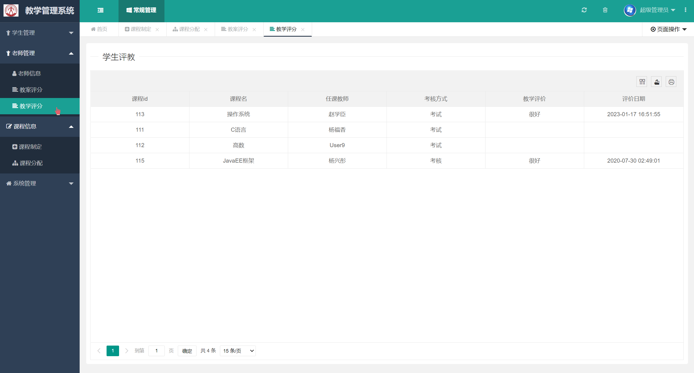

## 基于SSM框架的教学管理系统

###  获取sql数据库文件: 从戎源码网 (https://armycodes.com/) QQ: 386869957 QQ群: 377586148
###  所有系统地址: (https://github.com/YuLin-Coder/AllProjectCatalog) 
###  所有项目以及源代码本人均调试运行无问题 可支持远程安装部署调试、定制修改、代码讲解

## 项目介绍
基于SSM框架的教学管理系统，系统分为用户和管理员两个角色，主要功能如下
学生：我的评教、我的成绩、我的课程
老师：学生学习情况、我的课程、我的备课
管理员：
学生管理：学生信息、学生成绩及学习情况
老师管理：教师信息、教学评分、教案评分、
课程信息管理：课程制定、课程分配
系统课程管理：日志管理、系统公告、数据库监控

## 项目技术
- 编程语言：Java
- 数据库：MySQL
- 前端技术：JSP、JavaScript、LayUI、jquery
- 后端技术：Spring、SpringMVC、MyBatis

## 运行环境
- JDK版本：JDK1.8及以上
- 开发工具：IDEA、Ecplise、Myecplise都可以
- 数据库: MySQL5.7及以上
- Maven：maven3.0及以上

## 运行截图

